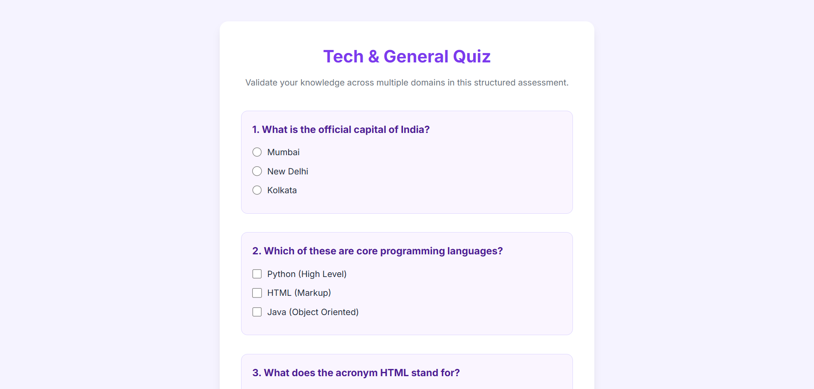
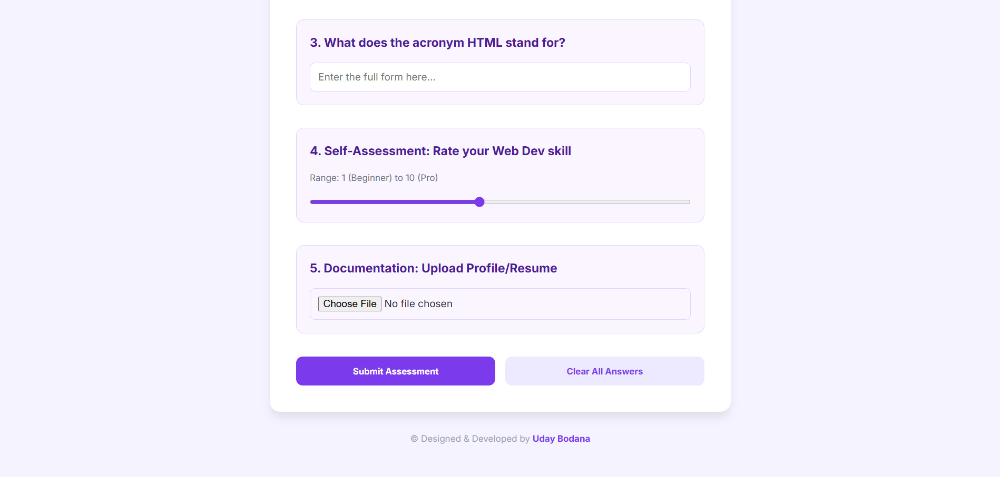

# 📝 Online Quiz

A clean, high-end, and interactive quiz assessment layout offering diverse question and input formats. Designed with a modern, structured card interface and vibrant visual styles.

---

## ✨ Features

- **Multi-Format Inputs:** Includes radio buttons, checkboxes, text fields, range sliders, and file uploads.
- **Premium Input Aesthetics:** Clean input focus states with colorful border glows and active shadows.
- **Micro-Animations:** Sleek hover and active effects for submission and clear buttons.
- **Fully Responsive Design:** Adapts smoothly across all modern mobile and desktop screens.

---

## 🚀 How to Use

1. **Answer Questions:** Provide inputs for each quiz question (Text, Multiple Choice, Multi-Selection, etc.).
2. **Review Options:** Use the range slider or optional fields to refine your assessment.
3. **Submit:** Click the **Submit** button to submit your responses.

---

## 💻 Tech Stack

- **HTML5**
- **CSS3**

---

## 🏃 How to Run

1. Clone or download this repository.
2. Open `index.html` directly in any web browser, or use a local development server like **Live Server** in VS Code.

---

## 📸 Preview

---

© Designed & Developed by **Uday Bodana**